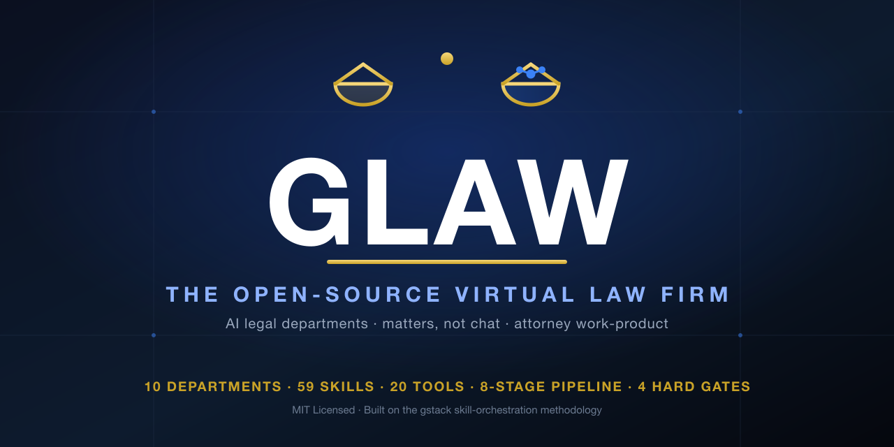

<div align="center">



# GLAW · The Open-Source Virtual Law Firm

**A full AI law firm you install as a skill. Not a chatbot — an org chart.**
GLAW runs legal *matters* (build a company, structure a fund, prosecute or defend a case, investigate fraud) through an **8-stage pipeline**, routing each step to the right **department**, and produces **attorney work-product** — pleadings, contracts, redlines, dossiers, filings — for a licensed attorney to review and sign.

[](LICENSE)
[](lib/firm-roster.md)
[](#-the-toolbelt-20-clis)
[](#%EF%B8%8F-the-departments)
[](#-the-workflow)
[](https://agentskills.org)
[](CONTRIBUTING.md)
[](#%EF%B8%8F-not-legal-advice-read-this)

</div>

---

## ⚡ TL;DR

```bash
# 1. install (clone into your Claude Code skills dir)
git clone https://github.com/USER/glaw ~/.claude/skills/glaw
cd ~/.claude/skills/glaw && ./setup        # deploys 59 skills + optional tools

# 2. open a matter and let the firm work it
/glaw                                       # "form a Delaware C-corp with a SAFE round"
```

GLAW turns one prompt into a **staffed engagement**: intake → strategy → structure → draft → adversarial red-team → file → docket → close — with **hard gates** (conflicts cleared, citations verified, adversary survived, UPL disclaimer) it will not skip.

---

## 🤔 Why GLAW

Most "AI lawyer" tools are a single prompt that answers one question. A real firm doesn't work that way — it has **departments**, a **pipeline**, **partners who check the associates**, and **deliverables**.

GLAW models the firm:

- **It's an org chart, not a chat.** Work routes to the seat that owns it — a Tax question goes to Tax, a fund to Securities, a fraud pattern to the Investigations Bureau.
- **It produces documents, not opinions.** The output of a matter is a signature-ready packet: pleadings, formation docs, an offering memo, a redlined contract with real Word tracked-changes, a dossier.
- **It red-teams itself.** No matter reaches "file" until an adversarial pass (opposing counsel / IRS / SEC / trustee) has tried to destroy every position and a partner has verified the survivors.
- **It refuses to freelance.** Every position maps to a seat in a single source-of-truth roster. No gaps, no made-up authority.
- **It's auditable.** Every matter has a folder, a docket, a timeline, and a paper trail.

Built on the **gstack** skill-orchestration methodology: a meta-skill orchestrator + dozens of focused sub-skills, deployed as top-level `/commands`.

---

## 🏛️ The Departments

GLAW ships **59 native skills** organized into ten departments. (It also *routes to* optional companion seats — e.g. `corporate-counsel`, `pe-vc-counsel`, `tax-strategy`, `financial-forensics` — if you have them installed; GLAW works without them and degrades gracefully.)

| Department | What it owns | Native seats (a sample) |
|---|---|---|
| **Firm Management** | Opens matters, drives the pipeline, holds the gates | `/glaw`, `/glaw-autocounsel`, `/glaw-ethics-conflicts`, `/glaw-legal-research`, `/glaw-legal-writing` |
| **Corporate & Transactional** | Entities, IP, contracts, employment, real estate | `/glaw-entity-architect`, `/glaw-ip-counsel`, `/glaw-commercial-contracts`, `/glaw-employment-counsel`, `/glaw-real-estate-counsel` |
| **Securities, Funds & Capital Markets** | Fund formation, disclosure, insider/market-abuse, enforcement | `/glaw-sec`, `/glaw-sec-disclosure`, `/glaw-sec-adviser`, `/glaw-sec-insider`, `/glaw-sec-marketabuse`, `/glaw-sec-enforcement` |
| **Tax & IRS** | Tax structuring, controversy, information returns | `/glaw-tax-report`, `/glaw-irs-file`, `/glaw-compliance-audit` |
| **Accounting & Finance** | Forensics, audit-readiness, valuation, CFO modeling | `/glaw-accounting`, `/glaw-audit-assurance` |
| **Litigation & Dispute Resolution** | Pleadings, motions, case law, evidence, veil-piercing | `/glaw-motion-drafting`, `/glaw-case-law-research`, `/glaw-evidence-timeline`, `/glaw-veil-piercing`, `/glaw-court-records` |
| **Investigations Bureau** *(white-collar)* | FBI-style fraud investigation → dossier | `/glaw-investigations`, `/glaw-bureau`, `/glaw-bureau-counterfraud`, `/glaw-bureau-osint`, `/glaw-bureau-humint`, `/glaw-bureau-field`, `/glaw-bureau-cyber`, `/glaw-bureau-fusion`, `/glaw-bureau-prosecutor` |
| **Intelligence Super-Structure** | Financial-intel + analysis cells + fusion command | `/glaw-command`, `/glaw-fincen` (`-aml/-sar/-ofac/-tbml/-crypto`), `/glaw-intel` (`-analyst/-geopolitical/-scitech/-counterintel`) |
| **Regulatory & Licensing** | Licensing, AML/BSA, immigration, privacy/data | `/glaw-licensing`, `/glaw-regulatory-aml`, `/glaw-immigration`, `/glaw-privacy-data` |
| **Private Client & Restructuring** | Estates & trusts, restructuring, cross-border | `/glaw-estate-trusts`, `/glaw-restructuring`, `/glaw-international` |

> The single source of truth for *who does what* is [`lib/firm-roster.md`](lib/firm-roster.md). Every stage consults it before drafting — that's the firm's no-gaps guarantee.

---

## 🔄 The Workflow

Every matter runs the same spine, branched into **three tracks** at intake:

```
intake → strategy → structure → draft → adversarial → file → docket → close
```

| Track | strategy = | structure = | draft = | adversarial = |
|---|---|---|---|---|
| **Litigation** (civil) | case theory | parties / claims map | pleadings & motions | opposing counsel red-team |
| **Corp / Fund build** | deal thesis | entity org chart + tax + cap table | formation / governance / offering docs | IRS + SEC + creditor red-team |
| **Investigation** (white-collar) | theory of wrongdoing | entity & flow-of-funds map | exposure matrix → complaint / referral | defense + prosecutor + judge red-team |

### 🚦 Four hard gates (never skipped)

1. **Conflicts cleared** before any substantive work (`/glaw-ethics-conflicts`).
2. **Citations verified** before filing (`/glaw-legal-research`) — the anti-hallucination guardrail.
3. **Adversarial RED → BLUE** before filing — a position the firm's own adversary destroys does not get filed.
4. **UPL disclaimer** on every external deliverable — GLAW produces *work-product*, not legal advice.

### 🕵️ The dossier escalation

When an investigation surfaces **red flags past threshold** (fraud tier, sanctions / securities / criminal hit), the Intelligence Super-Structure escalates from a routine briefing to a full **DOSSIER** — scored deterministically (`glaw-bureau-score`: a fraud 0–100 score + an FBI-style competency scorecard) and adversarially reviewed before it's relied on.

---

## 🧰 The Toolbelt (20 CLIs)

GLAW's brains are markdown; its hands are small, transparent CLIs in [`bin/`](bin/). The core (matter state) needs nothing but bash. The rest are progressive enhancement.

| Tool | Does |
|---|---|
| `glaw` | matter lifecycle — `matter new/list/use`, `stage`, `docket`, `timeline-log`, `config` |
| `glaw-setup` | deploys every sub-skill as a top-level `/glaw-*` command |
| `glaw-doctor` | health harness — asserts all skills resolve, all tools run, no dangling refs |
| **Contract chain** | |
| `glaw-contract-score` | deterministic contract-review **scorecard** (risk 0–100, tier, grade A–F, red-flag card) |
| `glaw-redline` | mark up a contract with comments + suggested rewrites, **accept/deny** each |
| `glaw-redline-docx` | real **Microsoft Word tracked changes** (`w:ins`/`w:del`) + redline / summary / memo PDFs |
| `glaw-review-chain` | **one-shot**: review → score → Word track-changes → publish, all into one folder |
| **Documents & research** | |
| `glaw-doc-extract` | any PDF/DOCX → text + metadata (Tika / opendataloader; OCR via Tesseract) |
| `glaw-cites` | extract & normalize legal citations (eyecite) |
| `glaw-court-scrape` | dockets / opinions via 300+ court scrapers (juriscraper) |
| `glaw-assemble` | fill DOCX templates (Jinja-in-Word) |
| `glaw-publish` | render any deliverable to **PDF + Google Doc + Google Slides** in the house style |
| **Tax / regulatory** | |
| `glaw-tax-report` | machine-validatable tax-report objects (JSON Schema) |
| `glaw-irs-file` | information-return transmission scaffold (1099 / W-2 → transmitter / SSA EFW2) |
| `glaw-compliance-audit` | data-driven corporate-compliance checklist runner |
| `glaw-exempt-org` | nonprofit / 990 lookup + financial-risk read (ProPublica API) |
| **Scoring & sign-off** | |
| `glaw-bureau-score` | fraud score + FBI competency scorecard (deterministic) |
| `glaw-chief-decision` | records the Chief's PROCEED / WITH-FIXES / WITH-CONDITIONS sign-off card |

---

## ✍️ Showcase: the contract-review chain

Three open-source projects + GLAW's tooling interlock into one command-driven pipeline — *contract → review → scorecard → real Word tracked changes → published deliverable* — all sharing one severity vocabulary (🔴 critical / 🟡 important / 🟢 acceptable):

```
contract-review  →  glaw-review-chain ──┬─ glaw-contract-score   (0–100 scorecard)
(the review brain)                       ├─ glaw-redline-docx      (Word tracked changes + PDFs)
                                         └─ glaw-publish           (PDF / Doc / Slides)
```

```bash
glaw-review-chain my-contract.docx findings.json --matter acme-msa \
  --doctype "SaaS MSA" --position Customer --counterparty "Acme Inc."
# → scorecard (e.g. 88/100 CRITICAL) + a Word file with real accept/reject tracked changes
```

Interoperates with [`legal-redline-tools`](https://github.com/evolsb/legal-redline-tools) (MIT) and [`claude-legal-skill`](https://github.com/evolsb/claude-legal-skill) (MIT).

---

## 🚀 Install

**Requires** [Claude Code](https://claude.com/claude-code) (or any [Agent Skills](https://agentskills.org)-compatible agent).

```bash
git clone https://github.com/USER/glaw ~/.claude/skills/glaw
cd ~/.claude/skills/glaw
./setup
```

`./setup` deploys the 59 sub-skills as `/glaw-*` commands, creates the state dir (`~/.glaw`), and (optionally) installs the Python toolbelt. The **core firm runs with zero dependencies**; the heavier tools want some extras:

| Capability | Needs |
|---|---|
| Citations / court scraping / Word redlines | `pip install -r requirements.txt` (a venv is fine) |
| PDF / Slides publishing | `pandoc`, `weasyprint` |
| OCR & doc extraction | `tesseract`, `poppler`, Java + Apache Tika, `opendataloader-pdf` |

Then just talk to it:

```text
/glaw   →  "incorporate a FL holdco over my opco and lock down asset protection"
/glaw   →  "review the attached MSA from the customer's side and redline it"
/glaw   →  "investigate this counterparty for fraud and build a dossier if it's there"
```

Run `bin/glaw-doctor` any time to confirm the whole firm is healthy.

---

## 🧱 Architecture

```
glaw/
├── SKILL.md              # /glaw — the Managing Partner (orchestrator)
├── bin/                  # 20 CLIs: state machinery + the toolbelt
├── lib/
│   ├── firm-roster.md    # SINGLE SOURCE OF TRUTH — seat → skill routing
│   ├── bureau-roster.md  # Investigations Bureau charter + scorecards
│   ├── house-style.css   # the firm's document look (Helvetica, justified, callouts)
│   ├── checklists/       # data-driven compliance checklists (s-corp / c-corp / llc / fund)
│   ├── schemas/          # JSON Schemas (tax reports, etc.)
│   └── templates/        # DOCX templates
├── intake/ strategy/ structure/ draft/ adversarial/ file/ docket/ matter-retro/
│                         #   the 8 pipeline stages (each a SKILL.md)
├── autocounsel/          # runs the review bench back-to-back
└── <practice-group + bureau + intel + sec + fincen agents>/   # the departments
```

State lives under `~/.glaw` (`matters/<slug>/` with `matter.md`, `docket.jsonl`, `timeline.jsonl`). See [`docs/`](docs/) for the deep dive.

---

## ⚖️ NOT legal advice (read this)

GLAW produces **attorney work-product drafts for a licensed attorney to review, sign, and file.** It does **not** form an attorney-client relationship, does **not** practice law, and is **not** a substitute for a lawyer. Laws vary by jurisdiction and change; every output must be verified by qualified counsel before it is relied on or filed. The authors provide this software "as is," without warranty. See [LICENSE](LICENSE).

---

## 🤝 Contributing

GLAW grows by adding **seats** (new SKILL.md departments) and **tools** (new CLIs) — never by letting a stage freelance a position. See [CONTRIBUTING.md](CONTRIBUTING.md). New skills must pass `bin/glaw-doctor`.

## 📜 License

[MIT](LICENSE) — use it, fork it, build your own firm on it. GLAW stands on the [gstack](https://github.com/garrytan/gstack) methodology and interoperates with [legal-redline-tools](https://github.com/evolsb/legal-redline-tools) and [claude-legal-skill](https://github.com/evolsb/claude-legal-skill).

<div align="center"><sub>GLAW · matters, not chat · ⚖️ + 🤖</sub></div>
