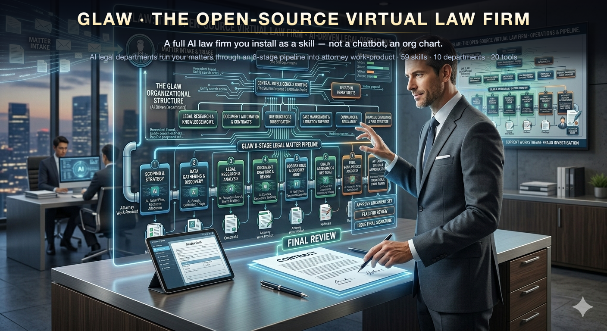
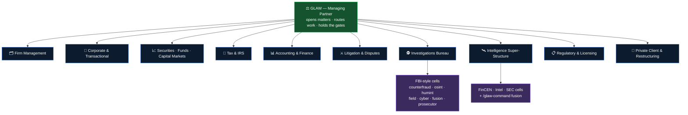
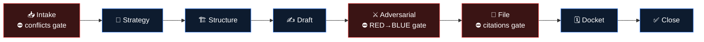
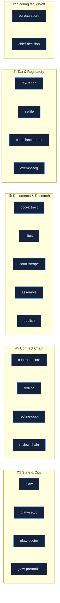
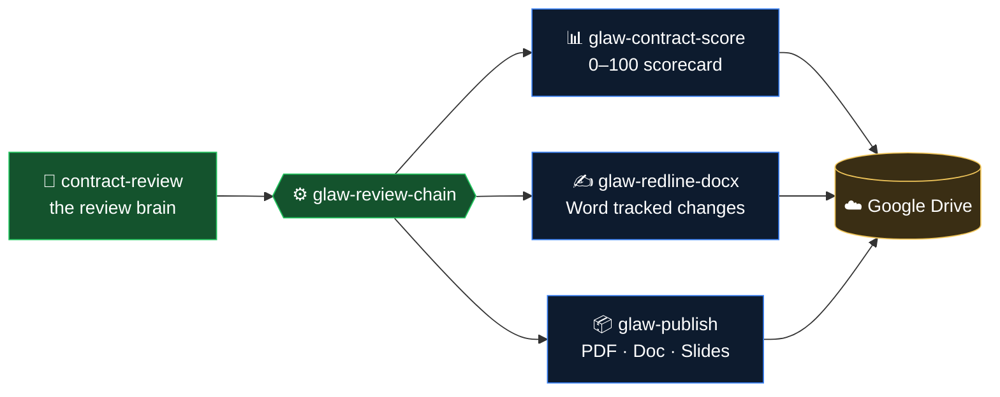
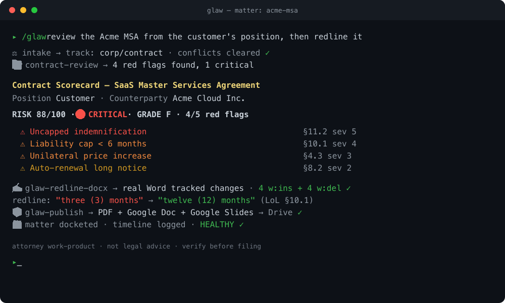
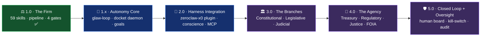
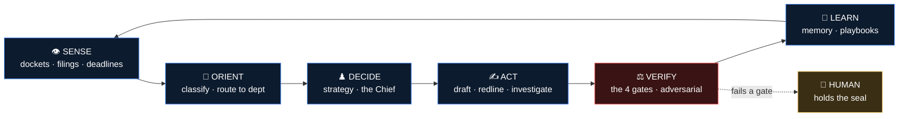

<div align="center">



# GLAW · The Open-Source Virtual Law Firm

**A full AI law firm you install as a skill. Not a chatbot — an org chart.**
GLAW runs legal *matters* (build a company, structure a fund, prosecute or defend a case, investigate fraud) through an **8-stage pipeline**, routing each step to the right **department**, and produces **attorney work-product** — pleadings, contracts, redlines, dossiers, filings — for a licensed attorney to review and sign.

[](https://github.com/rikitrader/glaw/actions/workflows/ci.yml)
[](LICENSE)
[](lib/firm-roster.md)
[](#-the-toolbelt-53-clis)
[](#%EF%B8%8F-the-departments)
[](#-the-workflow)
[](https://agentskills.org)
[](CONTRIBUTING.md)
[](ROADMAP.md)
[](#%EF%B8%8F-not-legal-advice-read-this)

</div>

---

## ⚡ TL;DR

```bash
# 1. install (clone into your Claude Code skills dir)
git clone https://github.com/rikitrader/glaw ~/.claude/skills/glaw
cd ~/.claude/skills/glaw && ./setup        # deploys 150 skills (88 native + 62 vendored seats) + tools

# 2. open a matter and let the firm work it
/glaw                                       # "form a Delaware C-corp with a SAFE round"
```

GLAW turns one prompt into a **staffed engagement**: intake → strategy → structure → draft → adversarial red-team → file → docket → close — with **hard gates** (conflicts cleared, citations verified, adversary survived, UPL disclaimer) it will not skip.

---

## ▶️ See a matter run

<div align="center">


<sub>One prompt → the firm opens the matter and walks all eight stages — clearing the conflicts, RED→BLUE, citations, and UPL gates — to a signature-ready packet. Every line is the real <code>bin/glaw</code> state machine; <a href="demo/glaw-matter-run.tape">re-record with vhs</a>.</sub>

</div>

---

## 🤔 Why GLAW

Most "AI lawyer" tools are a single prompt that answers one question. A real firm doesn't work that way — it has **departments**, a **pipeline**, **partners who check the associates**, and **deliverables**.

GLAW models the firm:

- **It's an org chart, not a chat.** Work routes to the seat that owns it — a Tax question goes to Tax, a fund to Securities, a fraud pattern to the Investigations Bureau.
- **It produces documents, not opinions.** The output of a matter is a signature-ready packet: pleadings, formation docs, an offering memo, a redlined contract with real Word tracked-changes, a dossier.
- **It red-teams itself.** No matter reaches "file" until an adversarial pass (opposing counsel / IRS / SEC / trustee) has tried to destroy every position and a partner has verified the survivors.
- **It refuses to freelance.** Every position maps to a seat in a single source-of-truth roster. No gaps, no made-up authority.
- **It's auditable.** Every matter has a folder, a docket, a timeline, and a paper trail.

Built on the **gstack** skill-orchestration methodology: a meta-skill orchestrator + dozens of focused sub-skills, deployed as top-level `/commands`.

---

## 🏛️ The Departments

GLAW ships **88 native skills** organized into ten departments **plus 62 self-contained specialist seats** vendored under [`seats/`](seats/) — `glaw-corporate-counsel`, `glaw-pe-vc-counsel`, `glaw-tax-strategy`, `glaw-financial-forensics`, the `glaw-fs-*` finance models, and more. **Zero external skill dependencies:** every seat the firm routes to travels with the repo and is deployed by `./setup`. A deterministic gate (`glaw-doctor`) proves it — every routed skill resolves, or CI fails.



| Department | What it owns | Native seats (a sample) |
|---|---|---|
| **Firm Management** | Opens matters, drives the pipeline, holds the gates | `/glaw`, `/glaw-autocounsel`, `/glaw-ethics-conflicts`, `/glaw-legal-research`, `/glaw-legal-writing` |
| **Corporate & Transactional** | Entities, IP, contracts, employment, real estate | `/glaw-entity-architect`, `/glaw-ip-counsel`, `/glaw-commercial-contracts`, `/glaw-employment-counsel`, `/glaw-real-estate-counsel` |
| **Securities, Funds & Capital Markets** | Fund formation, disclosure, insider/market-abuse, enforcement | `/glaw-sec`, `/glaw-sec-disclosure`, `/glaw-sec-adviser`, `/glaw-sec-insider`, `/glaw-sec-marketabuse`, `/glaw-sec-enforcement` |
| **Tax & IRS** | Tax structuring, controversy, information returns | `/glaw-tax-report`, `/glaw-irs-file`, `/glaw-compliance-audit` |
| **Accounting & Finance** | Forensics, audit-readiness, valuation, CFO modeling | `/glaw-accounting`, `/glaw-audit-assurance` |
| **Litigation & Dispute Resolution** | Pleadings, motions, case law, evidence, veil-piercing | `/glaw-motion-drafting`, `/glaw-case-law-research`, `/glaw-evidence-timeline`, `/glaw-veil-piercing`, `/glaw-court-records` |
| **Investigations Bureau** *(white-collar)* | FBI-style fraud investigation → dossier | `/glaw-investigations`, `/glaw-bureau`, `/glaw-bureau-counterfraud`, `/glaw-bureau-osint`, `/glaw-bureau-humint`, `/glaw-bureau-field`, `/glaw-bureau-cyber`, `/glaw-bureau-fusion`, `/glaw-bureau-prosecutor` |
| **Intelligence Super-Structure** | Financial-intel + analysis cells + fusion command | `/glaw-command`, `/glaw-fincen` (`-aml/-sar/-ofac/-tbml/-crypto`), `/glaw-intel` (`-analyst/-geopolitical/-scitech/-counterintel`) |
| **Regulatory & Licensing** | Licensing, AML/BSA, immigration, privacy/data | `/glaw-licensing`, `/glaw-regulatory-aml`, `/glaw-immigration`, `/glaw-privacy-data` |
| **Private Client & Restructuring** | Estates & trusts, restructuring, cross-border | `/glaw-estate-trusts`, `/glaw-restructuring`, `/glaw-international` |

> The single source of truth for *who does what* is [`lib/firm-roster.md`](lib/firm-roster.md). Every stage consults it before drafting — that's the firm's no-gaps guarantee.

---

## 🔄 The Workflow

Every matter runs the same spine, branched into **three tracks** at intake:



| Track | strategy = | structure = | draft = | adversarial = |
|---|---|---|---|---|
| **Litigation** (civil) | case theory | parties / claims map | pleadings & motions | opposing counsel red-team |
| **Corp / Fund build** | deal thesis | entity org chart + tax + cap table | formation / governance / offering docs | IRS + SEC + creditor red-team |
| **Investigation** (white-collar) | theory of wrongdoing | entity & flow-of-funds map | exposure matrix → complaint / referral | defense + prosecutor + judge red-team |

### 🚦 Four hard gates (never skipped)

1. **Conflicts cleared** before any substantive work (`/glaw-ethics-conflicts`).
2. **Citations verified** before filing (`/glaw-legal-research`) — the anti-hallucination guardrail.
3. **Adversarial RED → BLUE** before filing — a position the firm's own adversary destroys does not get filed.
4. **UPL disclaimer** on every external deliverable — GLAW produces *work-product*, not legal advice.

### 🕵️ The dossier escalation

When an investigation surfaces **red flags past threshold** (fraud tier, sanctions / securities / criminal hit), the Intelligence Super-Structure escalates from a routine briefing to a full **DOSSIER** — scored deterministically (`glaw-bureau-score`: a fraud 0–100 score + an FBI-style competency scorecard) and adversarially reviewed before it's relied on.

---

## 🧰 The Toolbelt (53 CLIs)

GLAW's brains are markdown; its hands are small, transparent CLIs in [`bin/`](bin/). The core (matter state) needs nothing but bash. The rest are progressive enhancement.


<sub>All 20 are `glaw-*` CLIs (prefix dropped above for space). The core — `glaw`, `glaw-setup`, `glaw-doctor` — needs only bash; the rest enhance progressively.</sub>

| Tool | Does |
|---|---|
| `glaw` | matter lifecycle — `matter new/list/use`, `stage`, `docket`, `timeline-log`, `config` |
| `glaw-setup` | deploys every sub-skill as a top-level `/glaw-*` command |
| `glaw-doctor` | health harness — asserts all skills resolve, all tools run, no dangling refs |
| **Contract chain** | |
| `glaw-contract-score` | deterministic contract-review **scorecard** (risk 0–100, tier, grade A–F, red-flag card) |
| `glaw-redline` | mark up a contract with comments + suggested rewrites, **accept/deny** each |
| `glaw-redline-docx` | real **Microsoft Word tracked changes** (`w:ins`/`w:del`) + redline / summary / memo PDFs |
| `glaw-review-chain` | **one-shot**: review → score → Word track-changes → publish, all into one folder |
| **Documents & research** | |
| `glaw-doc-extract` | any PDF/DOCX → text + metadata (Tika / opendataloader; OCR via Tesseract) |
| `glaw-cites` | extract & normalize legal citations (eyecite) |
| `glaw-court-scrape` | dockets / opinions via 300+ court scrapers (juriscraper) |
| `glaw-assemble` | fill DOCX templates (Jinja-in-Word) |
| `glaw-publish` | render any deliverable to **PDF + Google Doc + Google Slides** in the house style |
| **Tax / regulatory** | |
| `glaw-tax-report` | machine-validatable tax-report objects (JSON Schema) |
| `glaw-irs-file` | information-return transmission scaffold (1099 / W-2 → transmitter / SSA EFW2) |
| `glaw-compliance-audit` | data-driven corporate-compliance checklist runner |
| `glaw-exempt-org` | nonprofit / 990 lookup + financial-risk read (ProPublica API) |
| **Bookkeeping & finance** | |
| `glaw-ledger` | the **persistent double-entry general ledger** (book of record) — post/import/rebuild, balances/GL as-of any date, period lock, year-end close, and an **`audit`** pack (tie-out + tamper-evidence + entry-to-source trace). |
| `glaw-journal` | post a **balanced** manual/adjusting journal entry (cash *or* non-cash — depreciation, accruals, reclasses). |
| `glaw-coa` | chart-of-accounts validator + ledger classification check (no `Uncategorized` leakage). |
| `glaw-comparative` | **comparative P&L** — MTD / prior period / YTD / budget side-by-side from the ledger. |
| `glaw-cashflow` | **indirect statement of cash flows** — tag-aware, self-reconciling to the change in cash. |
| `glaw-close-run` | **scheduled/automated close** (cron-safe) — runs the whole close on a book, writes a dated package, locks only if the gate passes; exit code reflects the gate. |
| `glaw-dashboard` | **management KPI pack** — margins, current/quick ratio, working capital, DSO/DPO, debt/equity, burn/runway, from the ledger. |
| `glaw-export` | **financial report export** — branded, printable HTML (print-to-PDF) combining statements + cash flow + KPIs + MD&A; optional Google Sheets push. |
| `glaw-amortize` | **loan** amortization (interest/principal split) + **prepaid/deferral** release schedules. |
| `glaw-narrative` | **SEC-filing-style narrative** — MD&A + notes to the financial statements, generated from the posted ledger. |
| `glaw-revrec` | **revenue recognition (ASC 606)** — deferred-revenue release schedule (ratable / milestone) + entries. |
| `glaw-tax-provision` | **income tax provision (ASC 740)** — current + deferred tax, ETR reconciliation, provision entry. |
| `glaw-inventory` | **inventory & COGS** — FIFO / weighted-average cost, ending inventory, gross margin. |
| `glaw-fx-reval` | **FX revaluation** — restate monetary foreign-currency balances to closing rate, gain/loss entry (asset vs liability). |
| `glaw-fx-report` | **multi-currency GL** — per-currency balances + **current-rate translation** to a reporting currency (BS@closing, P&L@average) with a balancing **CTA**. |
| `glaw-consolidate` | **consolidation** — combine entity ledgers + intercompany eliminations + **NCI** (minority interest) + **equity-method** (20-50%% investee) roll-forward. |
| `glaw-cash-apply` | **cash application** — match incoming receipts to open AR invoices (paid / partial / open). |
| `glaw-recurring` | **recurring entries** — standard period-end JE templates, validated balanced, posted to the ledger. |
| `glaw-subledger` | **subledger auto-posting** — register fixed-asset / deferred-revenue / loan schedules; each close auto-posts the due entry (idempotent). |
| `glaw-reconstruct` | **multi-account reconstruction** — rebuild audited books from many statements/accounts: continuity gate + transfer netting + per-account tie-out + control gate (drives `/glaw-reconstruct`). |
| `glaw-transfers` | **inter-account transfer netting** — detect & reclassify transfers between own accounts so the P&L isn't double-counted. |
| `glaw-continuity` | **statement completeness gate** — assert each account's statements chain (opening==prior close, no missing periods). |
| `glaw-je-test` | **JE forensics** — SAS-99 journal-entry tests (round-dollar / weekend / period-end / large / rare-account / manual) + **Benford's-law** first-digit analysis. |
| `glaw-bank-ingest` | bank/card statements (CSV·OFX·QFX·MT940·CAMT·PAIN·**PDF**) → deduped, **balance-verified** ledger → hledger / beancount / **Google Sheet**. Scanned PDFs via Tesseract OCR. Engine: bundled [`glaw_engine`](lib/bookkeeping). |
| `glaw-statements` | native **P&L / Balance Sheet / Cash Flow / Trial Balance** from the ledger (no hledger dep). Exits non-zero if the books don't balance. |
| `glaw-books-doctor` | the **bulletproof finance control gate** — TB balances, BS identity, Golden Rule, classified, cash≥0, dedup, anomaly scan, reconciled → "books are bulletproof, or fail." |
| `glaw-bank-rec` | true **bank reconciliation** — line-matches books vs bank, surfaces outstanding/unpresented checks + bank-only fees/interest. |
| `glaw-budget-vs-actual` | variance analysis — budget vs actuals, flags expense over-runs / income shortfalls past a threshold (drives `/glaw-budget`). |
| `glaw-depreciate` | depreciation schedules — **MACRS GDS** (IRS Pub 946) + straight-line, **§179** + bonus (drives `/glaw-fixed-assets`). |
| `glaw-aging` | AR/AP **aging buckets** (0-30 / 31-60 / 61-90 / 90+) per party (drives `/glaw-ap-ar`). |
| `glaw-cashflow-13w` | **13-week cash-flow** projection — running balance, trough, min-cash/covenant breach weeks (drives `/glaw-treasury`). |
| `glaw-ledger-monitor` | continuous **anomaly/fraud scan** — duplicate payments, round-dollar, weekend entries, lone-large-vendor (drives `/glaw-ledger-monitor`). |
| **Scoring & sign-off** | |
| `glaw-bureau-score` | fraud score + FBI competency scorecard (deterministic) |
| `glaw-chief-decision` | records the Chief's PROCEED / WITH-FIXES / WITH-CONDITIONS sign-off card |

---

## 🧮 Bookkeeping engine

The Accounting department ships a self-contained, **deterministic, $0** bookkeeping engine
([`lib/bookkeeping/glaw_engine`](lib/bookkeeping)) — no LLM required for structured formats.

```bash
# any statement → categorized, balance-checked Google Sheet
glaw-bank-ingest statement.pdf --matter acme --chart roofing --format gsheet
#   PDF → opendataloader/Tesseract → engine (dedup + Golden-Rule verify) → chart → Sheet
```

- **6 structured formats** parsed deterministically + **digital & scanned PDFs** (OCR).
- **Golden-Rule check**: `opening + credits − debits == closing` → `verified` / `discrepancy`.
- **Bundled charts of accounts** (`--chart fund|roofing|personal`) or your own regex rules.
- Exports **hledger**, **beancount**, **json**, or a tabbed **Google Sheet**. Every row keeps an
  immutable hash + a `source_method` audit tag. Feeds `/glaw-financial-forensics`.

---

## ✍️ Showcase: the contract-review chain

Three open-source projects + GLAW's tooling interlock into one command-driven pipeline — *contract → review → scorecard → real Word tracked changes → published deliverable* — all sharing one severity vocabulary (🔴 critical / 🟡 important / 🟢 acceptable):



```bash
glaw-review-chain my-contract.docx findings.json --matter acme-msa \
  --doctype "SaaS MSA" --position Customer --counterparty "Acme Inc."
# → scorecard (e.g. 88/100 CRITICAL) + a Word file with real accept/reject tracked changes
```

Interoperates with [`legal-redline-tools`](https://github.com/evolsb/legal-redline-tools) (MIT) and [`claude-legal-skill`](https://github.com/evolsb/claude-legal-skill) (MIT).

<div align="center">



<sub>One prompt → intake → review → an 88/100 CRITICAL scorecard → real Word tracked changes → published to Drive.</sub>

</div>

---

## 🚀 Install

**Requires** [Claude Code](https://claude.com/claude-code) (or any [Agent Skills](https://agentskills.org)-compatible agent).

```bash
git clone https://github.com/rikitrader/glaw ~/.claude/skills/glaw
cd ~/.claude/skills/glaw
./setup
```

`./setup` deploys the 59 sub-skills as `/glaw-*` commands **plus the 62 vendored seats**, creates the state dir (`~/.glaw`), and (optionally) installs the Python toolbelt. The **core firm runs with zero dependencies**; the heavier tools want some extras:

| Capability | Needs |
|---|---|
| Citations / court scraping / Word redlines | `pip install -r requirements.txt` (a venv is fine) |
| PDF / Slides publishing | `pandoc`, `weasyprint` |
| OCR, doc extraction & scanned-PDF bookkeeping | `tesseract`, `poppler` (`pdftoppm`), Java + Apache Tika, `opendataloader-pdf` |

### 🔐 Environment & credentials (`.env`)

GLAW's **core needs no secrets** — matters, drafting, the pipeline, and structured-format
bookkeeping all run locally with nothing configured. A few *optional* enhancements read
credentials. Copy [`.env.example`](.env.example) → `.env` and set only what you use:

| Variable / file | Used by | For |
|---|---|---|
| `~/.gcp/token.json` (OAuth) | `glaw-bank-ingest --format gsheet`, `glaw-publish` | Google Sheets / Docs / Slides output |
| `BSP_HYBRID_MODEL` *(opt)* | bookkeeping PDF path | text-LLM for non-tabular PDFs (e.g. `ollama/llama3`) |
| `BSP_HYBRID_VISION_MODEL` *(opt)* | bookkeeping scans | vision model for image-only PDFs (default path is Tesseract, $0) |
| `COURTLISTENER_TOKEN` *(opt)* | `glaw-court-scrape` | higher CourtListener rate limits |
| `PROPUBLICA_API_KEY` *(opt)* | `glaw-exempt-org` | nonprofit / 990 lookups |

> **Never commit secrets.** `.env`, `*.key`, `*.pem`, `*.enc`, and token JSON are
> git-ignored, and `glaw-doctor [6/6]` **fails the build** if a live key, credential file,
> or real client data ever lands in the tree. GLAW ships **no** secrets and **no** personal data.

Then just talk to it:

```text
/glaw   →  "incorporate a FL holdco over my opco and lock down asset protection"
/glaw   →  "review the attached MSA from the customer's side and redline it"
/glaw   →  "investigate this counterparty for fraud and build a dossier if it's there"
```

Run `bin/glaw-doctor` any time to confirm the whole firm is healthy.

---

## 🧱 Architecture

```
glaw/
├── SKILL.md              # /glaw — the Managing Partner (orchestrator)
├── bin/                  # 24 CLIs: state machinery + toolbelt + bookkeeping + finance control
├── seats/                # 62 SELF-CONTAINED specialist seats (glaw-*) + MANIFEST
│                         #   every skill the firm routes to — zero external deps
├── lib/
│   ├── firm-roster.md    # SINGLE SOURCE OF TRUTH — seat → skill routing
│   ├── bookkeeping/      # glaw_engine (bank-statement parser) + charts of accounts
│   ├── bureau-roster.md  # Investigations Bureau charter + scorecards
│   ├── house-style.css   # the firm's document look (Helvetica, justified, callouts)
│   ├── forms-library/    # SEC/state form exemplars (DE/FL/TX)
│   ├── checklists/       # data-driven compliance checklists (s-corp / c-corp / llc / fund)
│   ├── schemas/          # JSON Schemas (tax reports, etc.)
│   └── templates/        # DOCX templates
├── intake/ strategy/ structure/ draft/ adversarial/ file/ docket/ matter-retro/
│                         #   the 8 pipeline stages (each a SKILL.md)
├── autocounsel/          # runs the review bench back-to-back
├── bookkeeping/          # /glaw-bookkeeping seat
└── <practice-group + bureau + intel + sec + fincen agents>/   # the departments
```

State lives under `~/.glaw` (`matters/<slug>/` with `matter.md`, `docket.jsonl`, `timeline.jsonl`). Deep dives: **[departments reference](docs/departments.md)** · **[toolbelt reference](docs/tools.md)** · [org chart & usage](docs/org-chart-and-usage.md).

---

## ⚖️ NOT legal advice (read this)

GLAW produces **attorney work-product drafts for a licensed attorney to review, sign, and file.** It does **not** form an attorney-client relationship, does **not** practice law, and is **not** a substitute for a lawyer. Laws vary by jurisdiction and change; every output must be verified by qualified counsel before it is relied on or filed. The authors provide this software "as is," without warranty. See [LICENSE](LICENSE).

---

## 🧭 Where it's going

GLAW is evolving from a *firm* into a self-driving **AI agency** — an organism that senses a
situation, reasons across departments, drafts and acts, checks itself against its own
conscience (the gates), and learns. Next stops: an **Autonomy Core** (a goal-driven matter
loop + docket daemon), **harness integration** (an Extism plugin + conscience adoption for
autonomous runtimes like `zeroclaw-x0`, plus an MCP server), and new **branches** —
starting with **Constitutional Law** (`/glaw-constitutional`, `/glaw-legislative`,
`/glaw-admin-law`, `/glaw-judicial`). Throughout, one rule never bends: **the seal stays in
human hands** — GLAW prepares, a person commits.



**The organism loop** — how it thinks. The 4 gates are its conscience; matters are its memory. The seal stays in human hands: no autonomous path may file, charge, sanction, pay, or bind anyone.



**→ Read the full [ROADMAP.md](ROADMAP.md)** (the organism model, every phase, harness wiring,
gap analysis, and the non-negotiable guardrails).

## 🤝 Contributing

GLAW grows by adding **seats** (new SKILL.md departments) and **tools** (new CLIs) — never by letting a stage freelance a position. See [CONTRIBUTING.md](CONTRIBUTING.md). New skills must pass `bin/glaw-doctor`.

## 🔐 Security

GLAW ships **no secrets and no personal data**, and CI enforces it — `glaw-doctor [6/6]`
fails the build on any live key, credential file, or real client data. Keep matters under
`~/.glaw/` (git-ignored), never in the skill tree. Report vulnerabilities privately — see
[SECURITY.md](SECURITY.md).

## 📜 License

[MIT](LICENSE) — use it, fork it, build your own firm on it. GLAW **vendors** some
third-party components (the Apache-2.0 bookkeeping engine, MIT seats) — each keeps its own
license; full credits in [ATTRIBUTIONS.md](ATTRIBUTIONS.md). GLAW stands on the [gstack](https://github.com/garrytan/gstack) methodology and interoperates with [legal-redline-tools](https://github.com/evolsb/legal-redline-tools) and [claude-legal-skill](https://github.com/evolsb/claude-legal-skill).

<div align="center"><sub>GLAW · matters, not chat · ⚖️ + 🤖</sub></div>
