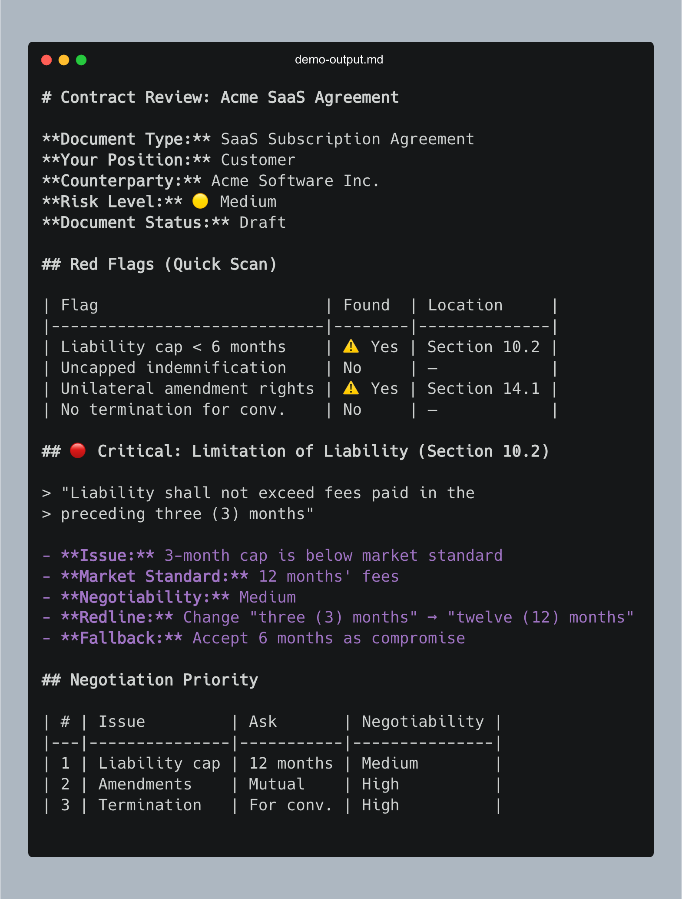

# Contract Review — Agent Skill for Legal Analysis

> AI-powered contract review with CUAD risk detection, market benchmarks, and lawyer-ready redlines

[](LICENSE)
[](https://agentskills.io)
[](https://github.com/TheAtticusProject/cuad)
[]()

**Works with:** Claude Code · OpenAI Codex · Cursor · GitHub Copilot · Gemini CLI · [26+ tools](https://agentskills.io)

## GLAW Install

This skill is vendored inside GLAW at `contract-review/` and is deployed by
GLAW's setup flow. Do not clone an external copy for normal GLAW use.

## Try It

```
Review this NDA - I'm the receiving party
```

### Example Output



---

## Why This Exists

I was reviewing real contracts — NDAs, SaaS agreements, M&A docs, merchant agreements — and wanted AI assistance directly in my coding workflow. So I researched what was available:

- **Commercial legal AI** (Kira, Ironclad, LegalOn, Harvey, Spellbook) — enterprise-only, custom quotes, no API access for individual developers
- **Open source tools** (LexNLP, OpenContracts, LawGlance) — incomplete projects requiring significant integration work, none designed for AI coding assistants
- **Generic contract checklists** — one-size-fits-all reviews that don't differentiate between an NDA and an M&A agreement, give the same advice to buyers and sellers, and say "negotiate this" without telling you *what to ask for*

Nothing worked as a drop-in skill. So I built one grounded in the [CUAD dataset](https://github.com/TheAtticusProject/cuad) (41 legal risk categories from 510 real contracts), tested it against actual agreements, and iterated until the output was useful for real negotiations.

The result: position-aware review with market benchmarks, document-type checklists, and actual redline language — not just a list of issues.

---

## What It Does

Analyzes legal contracts and outputs:
- **Risk assessment** with severity ratings (🔴 Critical / 🟡 Important / 🟢 Acceptable)
- **Red flags quick scan** — instant danger sign detection
- **Key terms table** with section references
- **Market standard benchmarks** — how terms compare to industry norms
- **Negotiability ratings** — what's realistic to change given power dynamics
- **Specific redlines** — actual replacement language, not just "negotiate this"
- **Missing provisions** with suggested language to add
- **Internal consistency checks** (broken cross-references, undefined terms)

### Generate Deliverables

This skill outputs structured JSON redlines. In GLAW, route deliverable assembly
through the bundled `glaw-redline`, `glaw-redline-docx`, and `glaw-publish`
tools when those optional document packages are installed:

```bash
# After the skill generates redlines.json:
glaw-redline-docx contract.docx redlines.json redlined.docx
glaw-publish redlined.docx
```

---

## Features

### Position-Aware Review
Tell it which party you are (customer, vendor, buyer, seller, receiving party) — the skill adjusts what it flags as risky.

### Document Type Checklists
Specialized checklists for each contract type:
- **NDA** — confidentiality term, non-solicitation, standstill, destruction certification
- **SaaS/MSA** — SLA, data export, suspension rights, price caps
- **Payment/Merchant** — reserves, chargebacks, network rules, auto-debit
- **M&A** — earnouts, escrow, rep survival, sandbagging
- **Finder/Broker** — fee tails, covered buyer definitions, joint representation

### Market Standard Benchmarks
Compares terms to industry norms with clear thresholds:

| Provision | Standard | Yellow | Red |
|-----------|----------|--------|-----|
| Liability cap | 12 months | 6-11 mo | <6 mo |
| Auto-renewal notice | 90+ days | 60-89 | <60 |
| Non-compete | 1-2 years | 3-4 years | 5+ |
| Rep survival (M&A) | 12-18 mo | 24-30 mo | 36+ mo |

### Negotiability Ratings
Tells you what's actually changeable:
- **High** — Mutual termination, cure periods, data export
- **Medium** — Liability cap increases, price caps
- **Low** — Network rules, regulatory requirements

### Red Flags Quick Scan
Instant detection of danger signs:
- Liability cap < 6 months
- Uncapped indemnification
- Unilateral amendment rights
- Perpetual obligations
- Offshore jurisdiction (BVI, Cayman)

### Jurisdiction Awareness
Flags when governing law affects enforceability:
- Non-competes void in CA/ND/OK/MN
- Delaware vs NY vs CA implications
- Offshore jurisdiction cost/enforcement concerns

### M&A Support
Special handling for acquisition agreements:
- Earnout mechanics and measurement
- Rep & warranty survival periods
- Working capital adjustments
- Escrow/holdback provisions
- Employment comp in deal value calculations

---

## Installation

This skill follows the open [Agent Skills standard](https://agentskills.io).
Within GLAW it is installed as part of the single app and should stay in this
repository so routing, tests, and deployment remain deterministic.

---

## Usage Examples

```
Review this NDA for red flags - I'm the receiving party

Analyze the indemnification in this MSA - I'm the vendor

What are the termination provisions? I'm the customer.

Review this acquisition agreement - I'm the seller

Check this merchant agreement - what's my chargeback exposure?
```

See [examples/](examples/) for full sample outputs.

---

## Limitations

- **Not legal advice** — always have material terms reviewed by qualified counsel
- **US law focus** — analysis defaults to US; provisions vary by jurisdiction
- **Context window** — very long contracts may need section-by-section review

## Accuracy

Based on ContractEval benchmarks, Claude achieves F1 ~0.62 on clause extraction. Best for first-pass review and issue flagging — not a replacement for attorney review on material deals.

---

## Credits

- [CUAD Dataset](https://github.com/TheAtticusProject/cuad) — Atticus Project (NeurIPS 2021)
- [LegalBench](https://hazyresearch.stanford.edu/legalbench/) — Stanford HAI
- [ContractEval](https://arxiv.org/abs/2303.07389) — Contract understanding benchmarks

## Next Steps

- **Need deliverables?** Use GLAW's bundled redline and publish tools to generate tracked-changes `.docx`, redline PDFs, and negotiation memos from the skill's output
- **Want examples?** See [examples/](examples/) for full sample reviews

## License

MIT — see [LICENSE](LICENSE)
