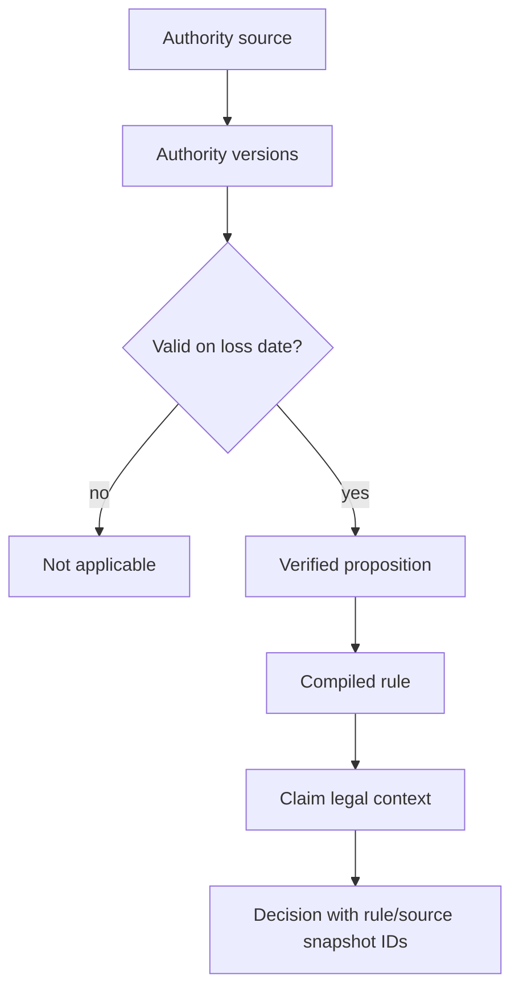
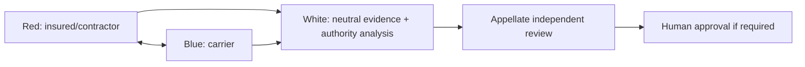

# PCLC architecture diagrams

## System

```mermaid
flowchart LR
  C[Claim facts + policy] --> I[Issue classifier]
  I --> J[Jurisdiction/date resolver]
  J --> S[Source registry + snapshots]
  S --> V[Authority verifier]
  V --> P[Propositions]
  P --> R[Safe rule DSL]
  R --> A[Red / Blue review]
  A --> W[White neutral review]
  W --> H[Human gate]
  H --> O[Versioned authority package]
  O --> GCAE[Coverage Authority Engine]
  GCAE --> X[Xactimate evidence engine]
```

## Temporal rule compilation

## Red/Blue/White

Semantic retrieval assists discovery only. Authority hierarchy, dates, policy language, and source verification control the result.
